# Análisis y Visualización de Incendios Forestales en México (2015-2024)
Este proyecto presenta un análisis exploratorio y de visualización de los **incendios forestales** registrados en **México** entre **2015 y 2024**, con el **objetivo** de **identificar patrones espaciales, temporales y de severidad** a partir de datos públicos. 
El propósito es generar una comprensión visual del fenómeno y establecer una base para un futuro modelo predictivo de riesgo de incendios. 

## Descripción General
Los incendios forestales representan uno de los principales problemas ambientales en México, afectando miles de hectáreas en varios puntos del territorio mexicano.
A través del análisis de datos abiertos de la **Comisión Nacional Forestal (CONAFOR)**, se examinan las causas, duración, superficie afectada y distribución geográfica de los incendios a lo largo del país.
El análisis cubre lo siguiente:
- **Periodo**: 2015-2024:
- **Fuente** ["Datos.gob.mx - Incendios Forestales"](https://datos.gob.mx/dataset/incendios_forestales/resource/ddf38874-6243-4437-8f76-19f797cafa5c)

## Contenido del proyecto
| Archivo| Descripción|
|---|---|
|```visualizations```| Carpeta con las visualizaciones exportadas (PNG)|
|```Incendios_Forestales_EDA.ipynb```| Notebook de análisis y visualización |
|```README.md```| Descripción del proyecto|
|```data-2025-11-05.csv```| Datos originales sin limpiar|
|```estados_mexico.zip```| Shapefile de estados (CONABIO) |
|```table_2025-11-05-16-51-38.csv```| Descripción de las variables |

## Limpieza y Preparación de Datos
- Se eliminaron columnas duplicadas y campos ```fn_``` sin valor.
- Las fechas se transformaron desde formato **timestamp** a fechas reales.
- Con la información de las fechas, se obtuvo la estación del incendio, esta será una variable.
- A partir de las fechas, se generaron variables como:
    - ```anio_inicio```
    - ```mes_inicio```
    - ```duracion_dias_num```
- Se corrigieron inconsistencias en nombre de estados, municipios y causas.
- Los puntos fuera del territorio nacional fueron **excluidos** con un filtro de GeoPandas.
- Se asignó la **región geográfica** (Noroesta, Noreste, Centro, Occidente, Sur-Sureste).

## 🔎Análisis Exploratorio 

El análisis abordó tres dimensiones principales:

1. **Temporal**:
   - Evolución anual de incendios y superficie afectada
2. **Geográfica**:
   - Distribución de incendios por estado, municipio y región.
   - Mapas de calor con concentración espacial. 
3. **Causal y de Severidad**:
   - Principales causas.
   - Promedio y total de hectáreas afectadas por año y región.

## Visualizaciones Principales
- 🔥**Incendios por causa**
  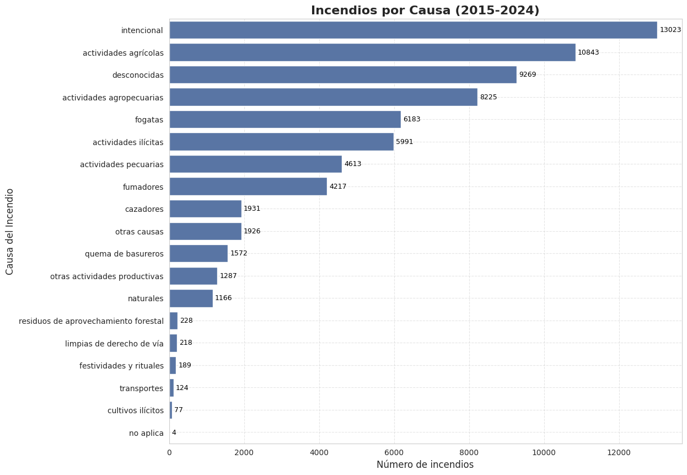
- 🗺️ **Mapas de concentración por estado y región (GeoPandas)**
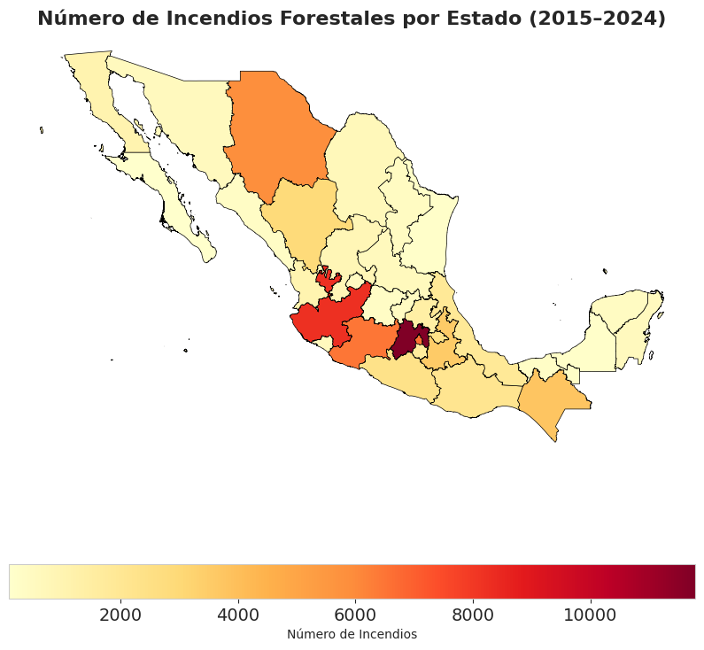
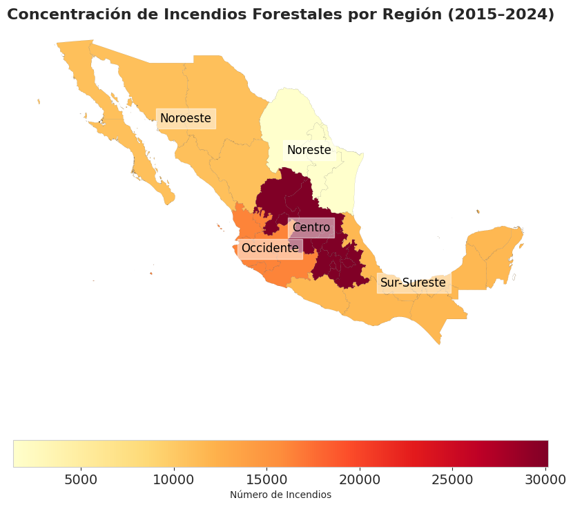
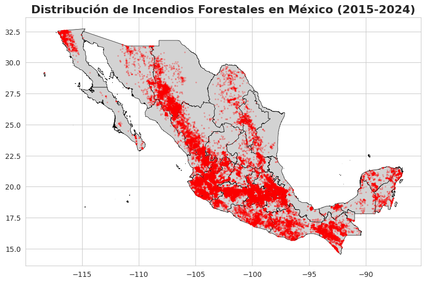

- 📆 **Tendencia Anual y Estsacional de hectáreas afectadas**

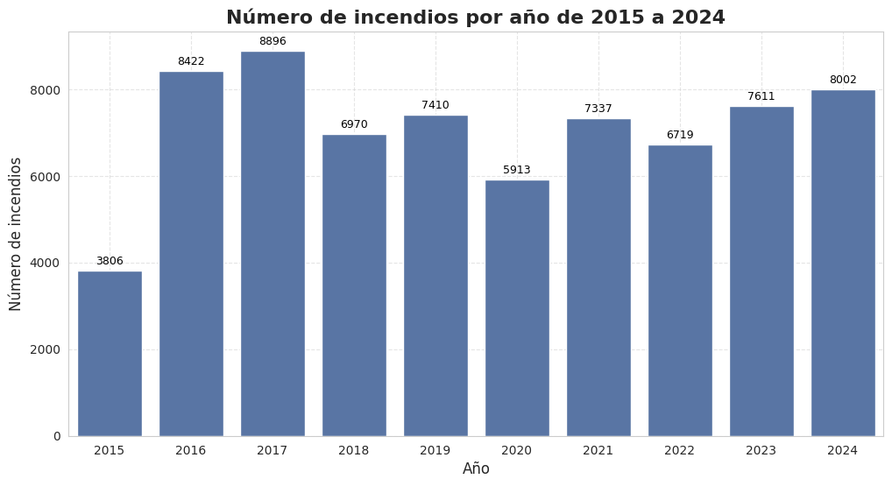
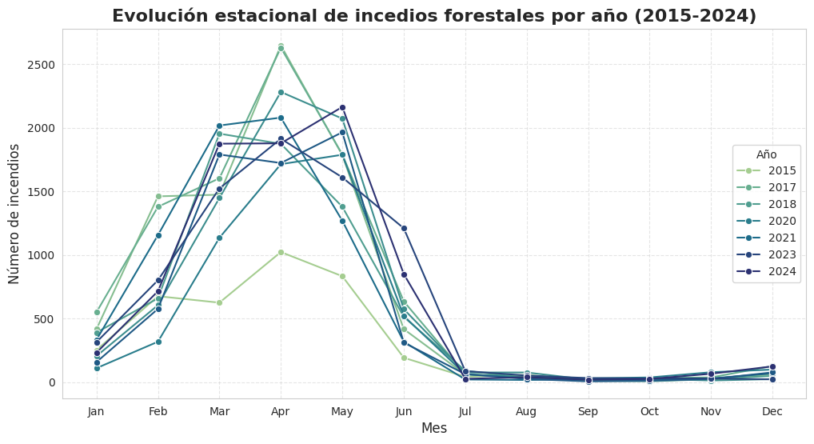
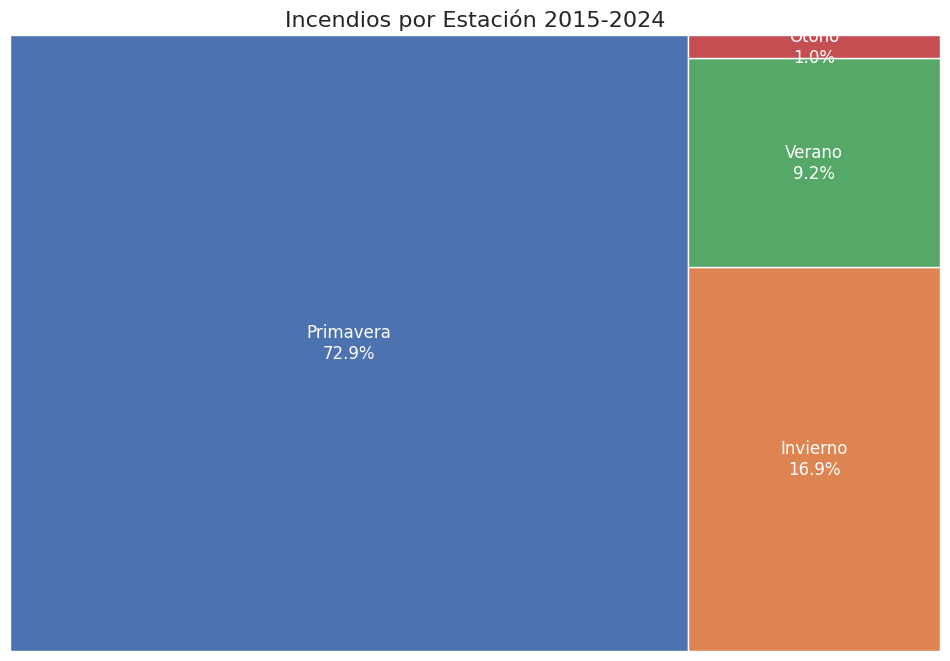

- 🌎 **Mapa de calor año vs mes**


- 🌏 **Estados con más incendios**
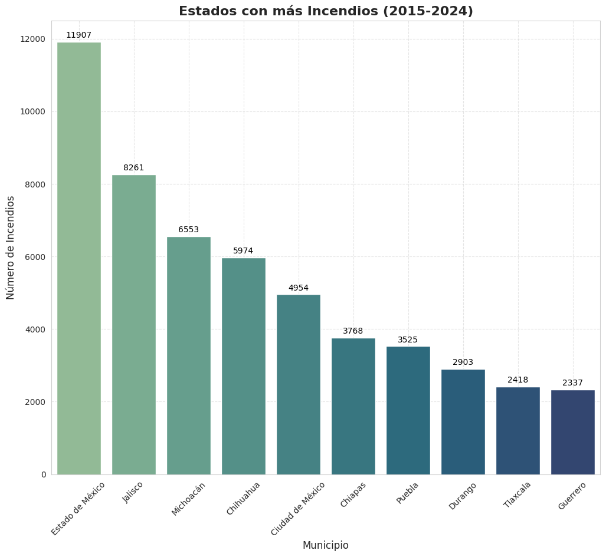

- 🔥 **Radar chart de superficie afectada por región**
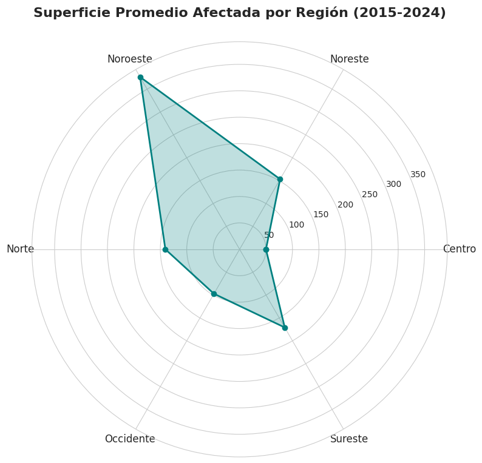

- 📍 **Municipios con mayor área afectada**
  
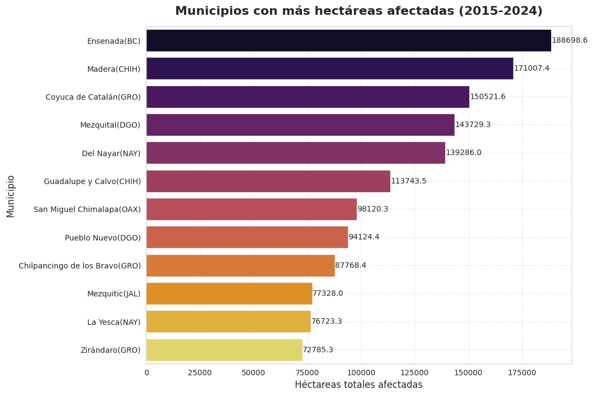

- 📶 **Evolución de Incendios Forestales por Estado**
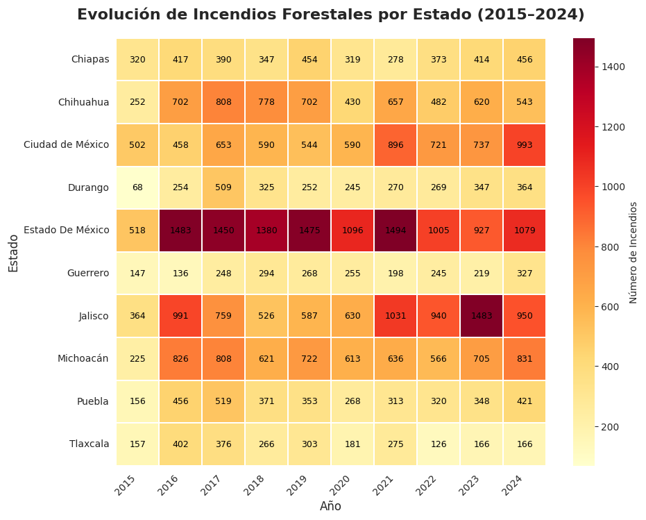

- 🔥 **Severidad Promedio por Región**
  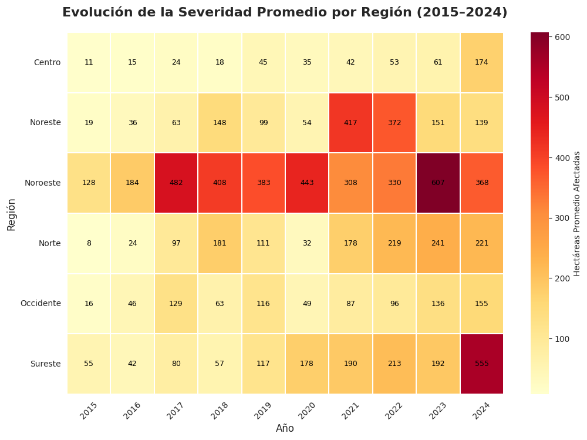

## Hallazgos Clave
## 🧰 Tecnologías Utilizadas
- **Python**:
    -```pandas```
    -```matplotlib```
    -```seaborn```
    -```geopandas```
    -```squarify```
    -```calendar```
- **Jupyter Notebooks** para desarrollo y análisis interactivo.
- **Datos geoespaciales**:
  - [Portal de Geoinformación 2025](http://www.conabio.gob.mx/informacion/gis/)
  - ["Datos.gob.mx - Incendios Forestales"](https://datos.gob.mx/dataset/incendios_forestales/resource/ddf38874-6243-4437-8f76-19f797cafa5c)

## 🧩 Próximos Pasos
- Integrar variables climáticas (temperatura, precipitación, humedad).
- Desarrollar un modelo predictivo de riesgo para incendios.
- Crear un dashboard interactivo con Streamlit o Plotly.

## Créditos
- **Autor**: [Andrés Guzmán Rodríguez](https://github.com/AndrsGzRo).
- **Fuente de datos**: CONAFOR/ Datos.gob.mx/ CONABIO
## Fuente de datos 
Este proyecto utiliza la base de datos [“Incendios forestales”](https://datos.gob.mx/dataset/incendios_forestales/resource/ddf38874-6243-4437-8f76-19f797cafa5c) publicada por la Comisión Nacional Forestal (CONAFOR). Última actualización 16 abril 2025. Licencia CC BY 4.0. 
